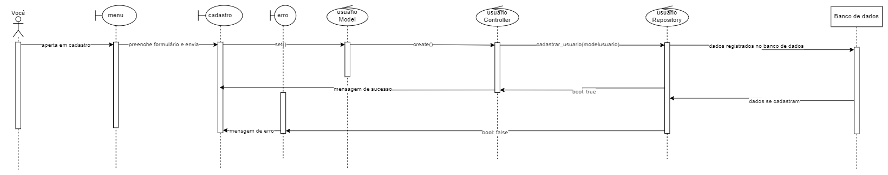

# Projeto CRUD para Produtos e Usuários

Este projeto é um exemplo de aplicativo CRUD (Create, Read, Update, Delete) para gerenciamento de produtos e usuários. Ele consiste em dois menus separados, um para produtos e outro para usuários. Cada menu possui três botões principais: Cadastro, Listar Todos e Buscar.

## Como usar

### Configuração do Banco de Dados
Antes de utilizar este projeto, certifique-se de ter um servidor MySQL local em execução. Você precisará configurar as informações de conexão com o banco de dados no arquivo [FATEC/dw-2-crud-rest-v2/backend/Database/config.php](https://github.com/vdanviel/FATEC/tree/dw-2-crud-rest-v2). Certifique-se de que as configurações estejam corretas antes de prosseguir.

### Iniciar o Servidor da API
Este projeto necessita da API [FATEC/dw-2-crud-rest-v2](https://github.com/vdanviel/FATEC/tree/dw-2-crud-rest-v2) em funcionamento. Baixe ela junto com este projeto separamente em sua máquina.
Não esquece que essa API é um projeto em composer, então inicie o composer com:

`composer update`

É necessário iniciar o servidor da API. Recomenda-se iniciar nativamente pelo PHP com o comando:

`php -S localhost:8080`

Certifique-se de iniciar o servidor somente com a porta 8080, pois o projeto está configurado com essa porta.
Também é importante lembrar que as tabelas em que o projeto se baseia está em [FATEC/dw-2-crud-rest-v2/backend/Database/db.txt](https://github.com/vdanviel/FATEC/tree/dw-2-crud-rest-v2), rode os SQL's necessários que estão nesse arquivo em banco de dados MYSQL.

### Como funciona

### Requisições da Aplicação
As requisições da aplicação são direcionadas para as pastas JavaScript respectivas. Quando um evento é acionado, são disparadas requisições para a API no endereço `http://localhost:8080/backend/router/(produto ou usuario)`. Cada verbo HTTP é utilizado da seguinte forma:

- GET: Usado para listar todos os itens (página "Listar Todos").
- GET com uma query "id": Usado para listar um item específico no banco de dados (página "Buscar").
- POST: Usado para cadastrar um item (página "Cadastrar").
- PUT: Usado para atualizar um item (dentro da página "Buscar", no formulário e no botão "Atualizar").
- DELETE: Usado para deletar um item (página "Buscar", no botão "Deletar" depois de um item ser buscado).

O front-end captura os dados do formulário utilizando JavaScript. Quando um formulário é preenchido e enviado, os dados são coletados utilizando métodos como `document.getElementById()` ou `document.querySelector()`, e em seguida, são formatados de acordo com a necessidade e enviados para o backend por meio de requisições HTTP.

### Cadastro
- Ao selecionar a opção de cadastro, preencha os dados necessários e clique em "Cadastrar" para adicionar um novo item ao banco de dados.

### Listar Todos
- Esta opção permite visualizar todos os itens registrados no banco de dados, seja de produtos ou usuários.

### Buscar
- Você pode buscar um item pelo seu campo de ID. Se o item existir, ele será automaticamente preenchido em um formulário adicional, onde você pode atualizá-lo ou excluí-lo.

## Diagrama de Sequência
