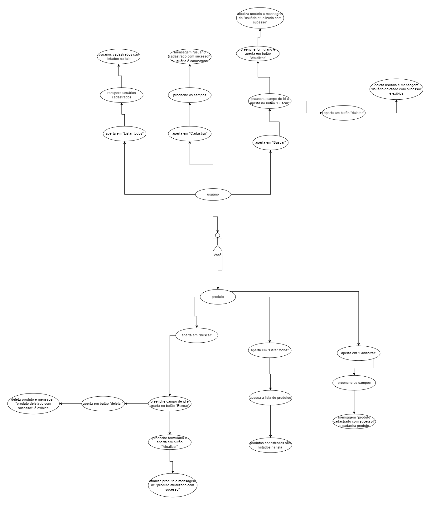

# Projeto CRUD para Produtos e Usuários

Este projeto é um exemplo de aplicativo CRUD (Create, Read, Update, Delete) para gerenciamento de produtos e usuários. Ele consiste em dois menus separados, um para produtos e outro para usuários. Cada menu possui três botões principais: Cadastro, Listar Todos e Buscar.

## Como usar

### Configuração do Banco de Dados
Antes de utilizar este projeto, certifique-se de ter um servidor MySQL local em execução. Você precisará configurar as informações de conexão com o banco de dados no arquivo [FATEC/dw-2-crud-rest-v2/backend/Database/config.php](https://github.com/vdanviel/FATEC/tree/dw-2-crud-rest-v2). Certifique-se de que as configurações estejam corretas antes de prosseguir.

### Iniciar o Servidor da API
Este projeto necessita da API [FATEC/dw-2-crud-rest-v2](https://github.com/vdanviel/FATEC/tree/dw-2-crud-rest-v2) em funcionamento. Baixe ela junto com este projeto separamente em sua máquina.
É necessário iniciar o servidor da API. Recomenda-se iniciar nativamente pelo PHP com o comando:

`php -S localhost:8080`

Certifique-se de iniciar o servidor somente com a porta 8080, pois o projeto está configurado com essa porta.
Também é importante lembrar que as tabelas em que o projeto se baseia está em [FATEC/dw-2-crud-rest-v2/backend/Database/db.txt](https://github.com/vdanviel/FATEC/tree/dw-2-crud-rest-v2), rode os SQL's necessários que estão nesse arquivo em banco de dados MYSQL.

### Como funciona

### Cadastro
- Ao selecionar a opção de cadastro, preencha os dados necessários e clique em "Cadastrar" para adicionar um novo item ao banco de dados.

### Listar Todos
- Esta opção permite visualizar todos os itens registrados no banco de dados, seja de produtos ou usuários.

### Buscar
- Você pode buscar um item pelo seu campo de ID. Se o item existir, ele será automaticamente preenchido em um formulário adicional, onde você pode atualizá-lo ou excluí-lo.

## Integração da API
Este projeto foi desenvolvido como uma integração de uma API que está em outra branch do repositório [FATEC/dw-2-crud-rest-v2](https://github.com/vdanviel/FATEC/tree/dw-2-crud-rest-v2).

## Diagrama de Uso
Diagrama de uso do projeto:
